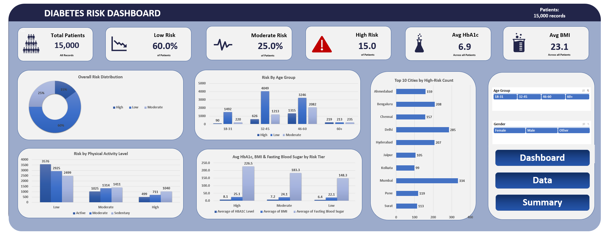

# Diabetes Risk Dashboard: Excel Capstone Project

An interactive Excel dashboard that analyses **15,000 patient records** to show who is at high, moderate and low risk of diabetes, and which health and lifestyle factors go with each risk tier.

Built with **Excel Tables, PivotTables, PivotCharts, Slicers and GETPIVOTDATA-driven KPI cards**.

> **Author:** [Your Name] | [LinkedIn profile link] | [Email or portfolio link]


<!-- Add a screenshot of the Dashboard sheet at images/dashboard.png -->

---

## Business question

> Which patients are most at risk of diabetes, and what do the high-risk groups have in common, so that screening and awareness efforts can be targeted?

## Key findings

| # | Finding | Evidence |
|---|---------|----------|
| 1 | **1 in 7 patients is high risk** | 15% High (2,250), 25% Moderate (3,750), 60% Low (9,000) |
| 2 | **Risk climbs steeply with age** | High-risk share: 5.0% (18-31), 10.6% (32-45), 19.8% (46-60), 32.8% (60+) |
| 3 | **Family history matters** | 19.7% high risk with a family history vs 12.5% without |
| 4 | **Inactivity matters** | 21.0% high risk among sedentary patients vs 9.8% among active patients |
| 5 | **Blood markers separate the tiers clearly** | Average HbA1c: 6.4 (Low), 7.2 (Moderate), 8.1 (High). Average fasting blood sugar: 148, 183, 227 mg/dL |
| 6 | **BMI differs only modestly** | Average BMI: 22.1 (Low), 24.1 (Moderate), 25.1 (High) |
| 7 | **Risk is similar across genders** | High-risk share: 15.2% female, 14.7% male (the "Other" group has only 153 records) |
| 8 | **High-risk patients are concentrated in large cities** | Mumbai (334), Delhi (285) and Bengaluru (208) lead; the top 10 cities hold 1,786 of the 2,250 high-risk patients |

Overall averages: **HbA1c 6.9**, **BMI 23.1**.

## What is in the workbook

| Sheet | Purpose |
|-------|---------|
| `Dashboard` | The finished, interactive report: KPI cards, five charts and two slicers |
| `Pivot Table` | Seven PivotTables that feed the KPIs and charts |
| `Data` | The cleaned source data (15,000 rows, 19 columns) stored as an Excel Table |

### Dashboard components

- **KPI cards:** Total Patients (15,000), Avg BMI (23.1), Avg HbA1c (6.9), High / Moderate / Low Risk share (15% / 25% / 60%)
- **Overall Risk Distribution** (doughnut chart)
- **Risk by Age Group** (column chart)
- **Top 10 Cities by High-Risk Count** (bar chart)
- **Risk by Physical Activity Level** (column chart)
- **Avg HbA1c, BMI and Fasting Blood Sugar by Risk Tier** (column chart)
- **Slicers:** Age Group and Gender, both connected to every PivotTable, so the whole dashboard filters at once
- **Navigation buttons:** Dashboard, Data and Summary

## Dataset

15,000 patient records with 19 fields:

| Group | Fields |
|-------|--------|
| Demographics | Patient ID, Age, Gender, City, Income Bracket |
| Body measures | BMI, Waist Circumference (cm) |
| Clinical | Fasting Blood Sugar, HbA1c Level, Systolic and Diastolic Blood Pressure |
| Lifestyle | Physical Activity Level, Diet Type, Smoking Status, Alcohol Consumption, Hours of Sleep, Stress Level |
| History | Family Diabetes History |
| Target | **Diabetes Risk** (Low / Moderate / High) |

Data quality checks: no missing cells, no duplicate Patient IDs, 18 cities, ages 18 to 80. Several fields contain a deliberate **"Not Reported"** category (Smoking, Alcohol, Income), which was kept as its own category rather than deleted.

**Data source:** [Add the source and licence here, e.g. course-provided dataset or public dataset link.]

## How it was built

A short summary is below. The full step-by-step is in **[PROCEDURE.md](PROCEDURE.md)**.

1. Loaded the data and converted it to an Excel Table
2. Ran data quality checks
3. Grouped `Age` into four bands: 18-31, 32-45, 46-60, 60+
4. Built seven PivotTables on one shared pivot cache
5. Created KPI cards with `GETPIVOTDATA`
6. Built five PivotCharts
7. Added Age Group and Gender slicers and connected them to all PivotTables
8. Designed the dashboard layout and navigation buttons

## How to use it

1. Download `Diabetes_Risk_Dashboard.xlsx` from this repository.
2. Open it in **desktop Excel (2016 or later, Windows or Mac)**. Slicers and PivotCharts are not fully supported in Excel for the web, Google Sheets or LibreOffice.
3. Go to the **Dashboard** sheet.
4. Click **Age Group** and **Gender** slicer buttons to filter every chart and KPI at the same time. Hold Ctrl to select several values.

## Limitations

- The analysis is **descriptive**. It shows associations, not causes, and it does not predict risk for new patients.
- The workbook does not document how the `Diabetes Risk` label was assigned. HbA1c ranges overlap between tiers, so the label is not a simple HbA1c cut-off.
- City counts largely follow how many records each city has. Comparing high-risk **rates** per city would be fairer.
- The "Other" gender group is small (153 records), so its percentages are unstable.

## Possible next steps

- Add high-risk **rate** by city instead of raw counts
- Add lifestyle drivers (diet, smoking, sleep, stress) and blood pressure to the dashboard
- Build a logistic regression or decision tree in Python or Power BI to predict risk
- Recreate the dashboard in Power BI or Tableau

## Skills demonstrated

Data cleaning and validation, PivotTables and PivotCharts, Slicers, GETPIVOTDATA, KPI design, dashboard layout, and turning data into plain-language insights.

## Repository structure

```
diabetes-risk-dashboard/
├── README.md
├── PROCEDURE.md
├── Diabetes_Risk_Dashboard.xlsx
└── images/
    └── dashboard.png
```

## Contact

Questions or feedback are welcome. Connect with me on [LinkedIn](#) or open an issue in this repository.

